# Diagram architektury UI - Moduł autentykacji

## Opis

Diagram przedstawia architekturę modułu autentykacji w aplikacji HabitFlow, obejmując:
- Frontend: Blazor Server z komponentami MudBlazor
- Backend: ASP.NET Core Minimal API z Clean Architecture
- Przepływ danych między warstwami
- Integrację z ASP.NET Core Identity

## Diagram

```mermaid
flowchart TD
    subgraph "Frontend - Blazor Server"
        subgraph "Layouts"
            AuthLayout["AuthLayout<br/>(Minimalny layout)"]
            MainLayout["MainLayout<br/>(Pełna nawigacja)"]
        end

        subgraph "Strony Auth"
            RegisterPage["/auth/register<br/>Rejestracja"]
            ConfirmEmailPage["/auth/confirm-email<br/>Potwierdzenie email"]
            LoginPage["/auth/login<br/>Logowanie"]
            ForgotPasswordPage["/auth/forgot-password<br/>Zapomniałem hasła"]
            ResetPasswordPage["/auth/reset-password<br/>Reset hasła"]
        end

        subgraph "Komponenty Auth"
            RegisterForm["RegisterForm.razor<br/>(Email, Password, ConfirmPassword)"]
            LoginForm["LoginForm.razor<br/>(Email, Password)"]
            ForgotPasswordForm["ForgotPasswordForm.razor<br/>(Email)"]
            ResetPasswordForm["ResetPasswordForm.razor<br/>(NewPassword, ConfirmPassword)"]
            ConfirmEmailResult["ConfirmEmailResult.razor<br/>(Wynik potwierdzenia)"]
        end

        subgraph "Strony Non-Auth"
            TodayPage["/today<br/>Ekran główny"]
            ProfileSecurityPage["/profile/security<br/>Ustawienia konta"]
            LogoutAction["/logout<br/>Akcja wylogowania"]
        end

        subgraph "Serwisy Frontend"
            AuthService["AuthService<br/>(Typed HttpClient)"]
            AuthStateProvider["AuthenticationStateProvider<br/>(Stan autentykacji)"]
            ApiClient["IHabitFlowApiClient<br/>(Wygenerowany klient)"]
        end
    end

    subgraph "Backend - Minimal API"
        subgraph "Endpoints"
            RegisterEndpoint["POST /api/v1/auth/register"]
            ConfirmEmailEndpoint["POST /api/v1/auth/confirm-email"]
            LoginEndpoint["POST /api/v1/auth/login"]
            ForgotPasswordEndpoint["POST /api/v1/auth/forgot-password"]
            ResetPasswordEndpoint["POST /api/v1/auth/reset-password"]
            MeEndpoint["GET /api/v1/auth/me"]
            LogoutEndpoint["POST /api/v1/auth/logout"]
            DeleteAccountEndpoint["POST /api/v1/auth/delete-account"]
        end

        subgraph "Application Layer - Commands"
            RegisterCommand["RegisterUserCommand"]
            ConfirmEmailCommand["ConfirmEmailCommand"]
            LoginCommand["LoginCommand"]
            ForgotPasswordCommand["ForgotPasswordCommand"]
            ResetPasswordCommand["ResetPasswordCommand"]
            LogoutCommand["LogoutCommand"]
            DeleteAccountCommand["DeleteAccountCommand"]
            GetMeQuery["GetMeQuery"]
        end

        subgraph "Infrastructure"
            UserManager["UserManager<br/>(ASP.NET Core Identity)"]
            SignInManager["SignInManager<br/>(Zarządzanie sesją)"]
            EmailSender["EmailSender<br/>(Wysyłka maili)"]
            TokenProvider["Token Provider<br/>(Tokeny jednorazowe)"]
        end

        subgraph "Kontrakty API"
            Contracts["RegisterRequest/Response<br/>LoginRequest/Response<br/>ConfirmEmailRequest<br/>ForgotPasswordRequest<br/>ResetPasswordRequest<br/>DeleteAccountRequest<br/>MeResponse"]
        end
    end

    subgraph "Przepływy danych"
        EmailFlow["Email z linkiem<br/>(Verification/Reset)"]
        CookieAuth["Cookie Authentication<br/>(Sesja użytkownika)"]
    end

    %% Połączenia Layouts → Pages
    AuthLayout --> RegisterPage
    AuthLayout --> ConfirmEmailPage
    AuthLayout --> LoginPage
    AuthLayout --> ForgotPasswordPage
    AuthLayout --> ResetPasswordPage

    MainLayout --> TodayPage
    MainLayout --> ProfileSecurityPage
    MainLayout --> LogoutAction

    %% Połączenia Pages → Components
    RegisterPage --> RegisterForm
    LoginPage --> LoginForm
    ForgotPasswordPage --> ForgotPasswordForm
    ResetPasswordPage --> ResetPasswordForm
    ConfirmEmailPage --> ConfirmEmailResult

    %% Połączenia Components → Services
    RegisterForm --> AuthService
    LoginForm --> AuthService
    ForgotPasswordForm --> AuthService
    ResetPasswordForm --> AuthService
    ConfirmEmailResult --> AuthService
    ProfileSecurityPage --> AuthService
    LogoutAction --> AuthService

    %% AuthService używa ApiClient
    AuthService --> ApiClient

    %% ApiClient komunikuje się z API
    ApiClient --> RegisterEndpoint
    ApiClient --> ConfirmEmailEndpoint
    ApiClient --> LoginEndpoint
    ApiClient --> ForgotPasswordEndpoint
    ApiClient --> ResetPasswordEndpoint
    ApiClient --> MeEndpoint
    ApiClient --> LogoutEndpoint
    ApiClient --> DeleteAccountEndpoint

    %% Endpoints → Commands
    RegisterEndpoint --> RegisterCommand
    ConfirmEmailEndpoint --> ConfirmEmailCommand
    LoginEndpoint --> LoginCommand
    ForgotPasswordEndpoint --> ForgotPasswordCommand
    ResetPasswordEndpoint --> ResetPasswordCommand
    LogoutEndpoint --> LogoutCommand
    DeleteAccountEndpoint --> DeleteAccountCommand
    MeEndpoint --> GetMeQuery

    %% Commands → Infrastructure
    RegisterCommand --> UserManager
    RegisterCommand --> EmailSender
    ConfirmEmailCommand --> UserManager
    LoginCommand --> SignInManager
    ForgotPasswordCommand --> UserManager
    ForgotPasswordCommand --> EmailSender
    ResetPasswordCommand --> UserManager
    LogoutCommand --> SignInManager
    DeleteAccountCommand --> UserManager
    GetMeQuery --> UserManager

    %% Infrastructure → Token Provider
    UserManager --> TokenProvider

    %% Email Flow
    EmailSender --> EmailFlow
    EmailFlow -.->|Link weryfikacyjny| ConfirmEmailPage
    EmailFlow -.->|Link resetu hasła| ResetPasswordPage

    %% Cookie Auth
    SignInManager --> CookieAuth
    CookieAuth -.->|Stan sesji| AuthStateProvider
    AuthStateProvider -.->|Autoryzacja| MainLayout

    %% Endpoints używają Contracts
    RegisterEndpoint -.->|Używa| Contracts
    LoginEndpoint -.->|Używa| Contracts
    ConfirmEmailEndpoint -.->|Używa| Contracts

    %% Style dla wyróżnienia
    classDef authComponent fill:#e1f5ff,stroke:#01579b,stroke-width:2px
    classDef endpoint fill:#fff9c4,stroke:#f57f17,stroke-width:2px
    classDef command fill:#f3e5f5,stroke:#4a148c,stroke-width:2px
    classDef infrastructure fill:#e8f5e9,stroke:#1b5e20,stroke-width:2px

    class RegisterForm,LoginForm,ForgotPasswordForm,ResetPasswordForm,ConfirmEmailResult authComponent
    class RegisterEndpoint,LoginEndpoint,ConfirmEmailEndpoint,LogoutEndpoint,DeleteAccountEndpoint endpoint
    class RegisterCommand,LoginCommand,ConfirmEmailCommand,LogoutCommand,DeleteAccountCommand command
    class UserManager,SignInManager,EmailSender,TokenProvider infrastructure
```

## Kluczowe elementy architektury

### Frontend (Blazor Server)

#### Layouts
- **AuthLayout**: Minimalny layout dla stron autentykacji (logo, podstawowa nawigacja)
- **MainLayout**: Pełny layout aplikacji z nawigacją (Today, Habits, Calendar, Charts, Notifications, Profile)

#### Strony autoryzacyjne
- `/auth/register` - Rejestracja nowego użytkownika
- `/auth/confirm-email` - Potwierdzenie adresu email (po kliknięciu linku z maila)
- `/auth/login` - Logowanie do aplikacji
- `/auth/forgot-password` - Formularz przypomnienia hasła
- `/auth/reset-password` - Reset hasła (po kliknięciu linku z maila)

#### Komponenty Auth (MudBlazor)
- **RegisterForm.razor**: Email, Password, ConfirmPassword + walidacja klienta
- **LoginForm.razor**: Email, Password + obsługa stanu (isLoading)
- **ForgotPasswordForm.razor**: Email + neutralny komunikat po wysłaniu
- **ResetPasswordForm.razor**: NewPassword, ConfirmPassword + ukryte token/userId z query
- **ConfirmEmailResult.razor**: Wyświetlenie wyniku potwierdzenia (sukces/błąd/wygasły token)

#### Strony aplikacji (po zalogowaniu)
- `/today` - Ekran główny (landing page po logowaniu)
- `/profile/security` - Ustawienia bezpieczeństwa, usunięcie konta
- `/logout` - Akcja wylogowania z przekierowaniem

#### Serwisy
- **AuthService**: Typed HttpClient do komunikacji z API auth, mapowanie ProblemDetails
- **AuthenticationStateProvider**: Zarządzanie stanem autentykacji (cookie-based)
- **IHabitFlowApiClient**: Wygenerowany klient API (NSwag) z metodami auth

### Backend (Minimal API + Clean Architecture)

#### API Endpoints (AuthEndpoints.cs)
- `POST /api/v1/auth/register` - Rejestracja (201/409/422)
- `POST /api/v1/auth/confirm-email` - Potwierdzenie email (204/404/409)
- `POST /api/v1/auth/login` - Logowanie (200/401/403)
- `POST /api/v1/auth/forgot-password` - Przypomnienie hasła (204)
- `POST /api/v1/auth/reset-password` - Reset hasła (204/400)
- `GET /api/v1/auth/me` - Pobranie danych zalogowanego użytkownika (200/401)
- `POST /api/v1/auth/logout` - Wylogowanie (204/401)
- `POST /api/v1/auth/delete-account` - Usunięcie konta (204/400/401)

#### Application Layer - Commands & Queries (CQS)
- **RegisterUserCommand**: Tworzenie nowego użytkownika + wysyłka maila weryfikacyjnego
- **ConfirmEmailCommand**: Potwierdzenie adresu email
- **LoginCommand**: Logowanie użytkownika
- **ForgotPasswordCommand**: Inicjacja resetowania hasła
- **ResetPasswordCommand**: Ustawienie nowego hasła
- **LogoutCommand**: Wylogowanie użytkownika
- **DeleteAccountCommand**: Trwałe usunięcie konta (hard delete)
- **GetMeQuery**: Pobranie informacji o zalogowanym użytkowniku

#### Infrastructure Layer
- **UserManager**: Zarządzanie użytkownikami (ASP.NET Core Identity)
- **SignInManager**: Zarządzanie sesją i logowaniem
- **EmailSender**: Wysyłka maili (linki weryfikacyjne, reset hasła)
- **Token Provider**: Generowanie jednorazowych tokenów (verification, reset)

#### Kontrakty (Request/Response)
- RegisterRequest/RegisterResponse
- LoginRequest/LoginResponse
- ConfirmEmailRequest
- ForgotPasswordRequest
- ResetPasswordRequest
- RefreshRequest/RefreshResponse
- DeleteAccountRequest
- MeResponse

### Przepływy danych

#### Rejestracja (US-001)
1. Użytkownik wypełnia `RegisterForm` (Email, Password, ConfirmPassword)
2. `AuthService` → `POST /api/v1/auth/register`
3. `RegisterCommand` → `UserManager` (utworzenie użytkownika)
4. `EmailSender` wysyła link weryfikacyjny
5. Użytkownik klika link → `/auth/confirm-email?userId=...&token=...`
6. `ConfirmEmailCommand` → `UserManager` (potwierdzenie)
7. Przekierowanie do `/auth/login`

#### Logowanie (US-002)
1. Użytkownik wypełnia `LoginForm` (Email, Password)
2. `AuthService` → `POST /api/v1/auth/login`
3. `LoginCommand` → `SignInManager` (weryfikacja + utworzenie cookie)
4. `CookieAuth` → `AuthenticationStateProvider` (aktualizacja stanu)
5. Przekierowanie do `/today`

#### Reset hasła (US-003)
1. Użytkownik wypełnia `ForgotPasswordForm` (Email)
2. `AuthService` → `POST /api/v1/auth/forgot-password`
3. `ForgotPasswordCommand` → `EmailSender` (wysyłka linku)
4. Użytkownik klika link → `/auth/reset-password?userId=...&token=...`
5. Użytkownik wypełnia `ResetPasswordForm` (NewPassword, ConfirmPassword)
6. `AuthService` → `POST /api/v1/auth/reset-password`
7. `ResetPasswordCommand` → `UserManager` (zmiana hasła)
8. Przekierowanie do `/auth/login`

#### Wylogowanie (US-020)
1. Użytkownik klika "Wyloguj" w menu
2. `AuthService` → `POST /api/v1/auth/logout`
3. `LogoutCommand` → `SignInManager` (inwalidacja cookie)
4. `AuthenticationStateProvider` (aktualizacja stanu)
5. Przekierowanie do `/auth/login`

#### Usunięcie konta (US-019)
1. Użytkownik otwiera `/profile/security`
2. Kliknięcie "Usuń konto" → modal z potwierdzeniem "DELETE"
3. `AuthService` → `POST /api/v1/auth/delete-account`
4. `DeleteAccountCommand` → `UserManager` (hard delete konta i danych)
5. Automatyczne wylogowanie + przekierowanie do `/auth/register`

## Bezpieczeństwo (US-023)

### Mechanizmy ochrony
- **Cookie-based authentication**: Sesja po stronie serwera, brak tokenów w local storage
- **Email verification**: Obowiązkowe potwierdzenie przed dostępem do aplikacji
- **Jednorazowe tokeny**: Verification i reset (z timeoutem, np. 60 min)
- **Autoryzacja zasobów**: Każde API weryfikuje userId z kontekstu autentykacji
- **Brak wycieku informacji**:
  - ForgotPassword zawsze zwraca 204 (nie ujawnia, czy email istnieje)
  - Login zwraca ogólny komunikat "Nieprawidłowy e-mail lub hasło"
- **ProblemDetails**: Standardowe mapowanie błędów (400/401/403/404/409/422/500)

### Walidacja
- **Klient** (DataAnnotations + MudBlazor): Format email, min 8 znaków hasła, zgodność haseł
- **Serwer** (Commands): Walidacja biznesowa, sprawdzanie unikalności, weryfikacja tokenów

## Zgodność z wymaganiami PRD

- ✅ US-001: Rejestracja z weryfikacją e-mail
- ✅ US-002: Logowanie
- ✅ US-003: Reset hasła
- ✅ US-019: Usunięcie konta
- ✅ US-020: Wylogowanie
- ✅ US-023: Bezpieczny dostęp do zasobów

## Notatki techniczne

- **Tech stack**: ASP.NET Core 9.0, Blazor Server, MudBlazor, ASP.NET Core Identity
- **Architektura**: Clean Architecture (Domain, Application, Infrastructure, Api)
- **Wzorce**: CQS (Commands/Queries), Repository, Unit of Work, Result pattern
- **Testy**: Unit tests + Integration tests (TestContainers dla bazy danych)
